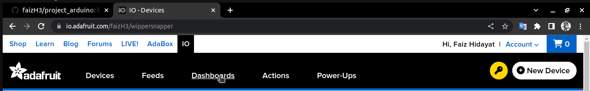
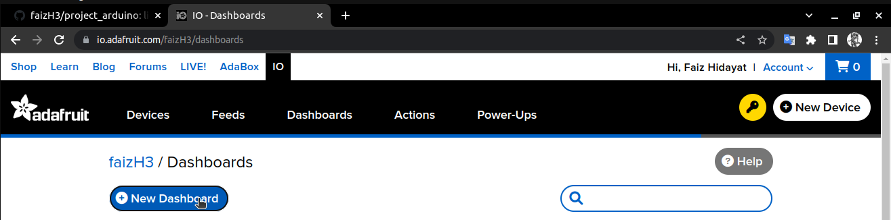
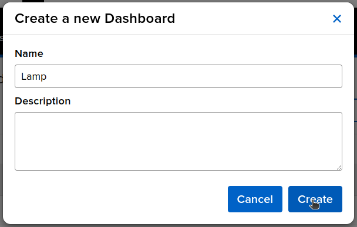
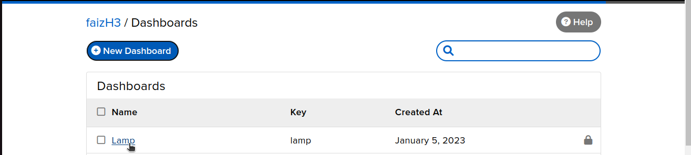
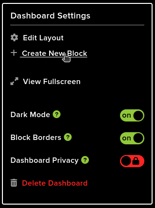
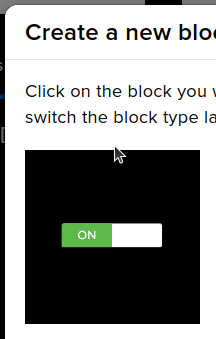
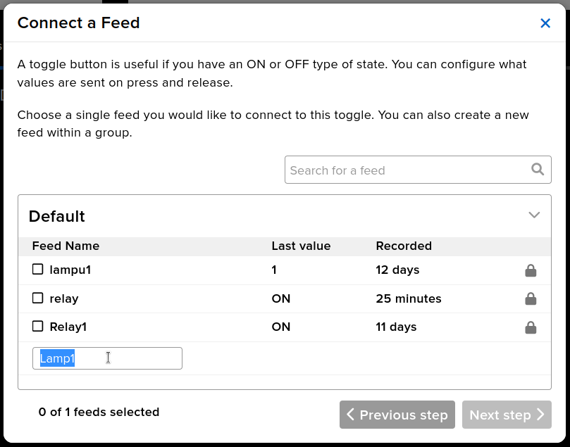
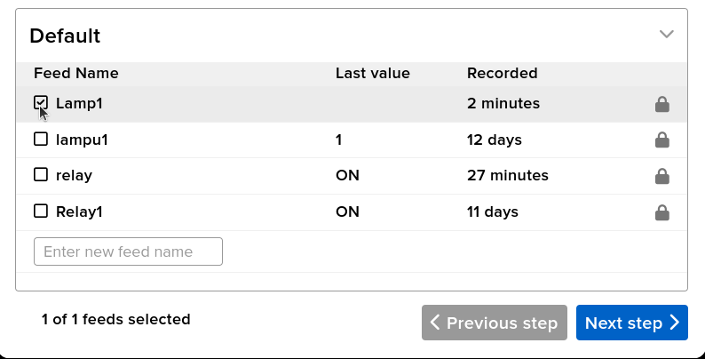
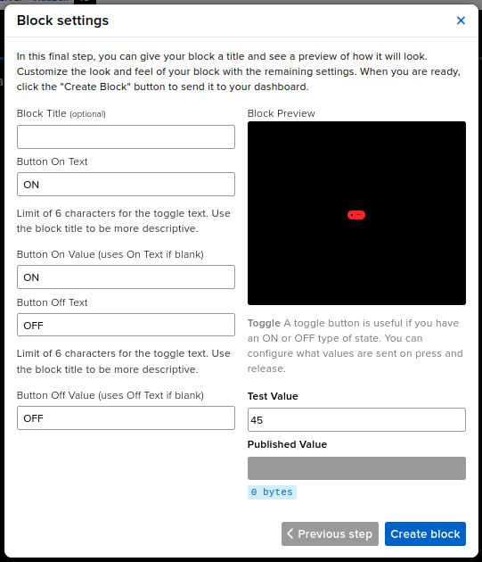

# project_arduino

#### Add Board Nodemcu:
1. Copy link:
    ```
    http://arduino.esp8266.com/stable/package_esp8266com_index.json,https://dl.espressif.com/dl/package_esp32_index.json
    ```
2. Select File>preference
3. Paste in Additional Boards Manager URLs

#### Add Library
1. Select Sketch>Include Library>Manage Libraries
2. Search `adafruit mqtt`
3. Click install

### Hardware Used
- NodeMCU ESP8266
- Relay module
- One 3W bulb

### Using platform
- Google Assistant
- Adafruit
- IFTTT

### Setup platform
1. Login [adafruit](Adafruit.com)
2. Click IO


3. Select Dashboards


4. Click New Dashboard


5. create name


6. Click name


7. 


8. create new block


9. 


10. Enter new feed name


11. select your feed name & next step


12. create block


13. 

---
**Setup pin**
| nodemcu esp8266 | relay |
|:--|:--|
| GND | GND |
| 3v | vcc |
| D4 | IN |


code
```c++
#include <ESP8266WiFi.h>
#include "Adafruit_MQTT.h"
#include "Adafruit_MQTT_Client.h"

#define Relay1            D4

#define WLAN_SSID       "Redmi"             // Your SSID
#define WLAN_PASS       "woruteyqip"        // Your password

/************************* Adafruit.io Setup *********************************/

#define AIO_SERVER      "io.adafruit.com"
#define AIO_SERVERPORT  1883                   // use 8883 for SSL
#define AIO_USERNAME    "faizH3"            // Replace it with your username
#define AIO_KEY         "aio_dTrt66xsOtAkaBYGI2bicEfuC1M6"   // Replace with your Project Auth Key

/************ Global State (you don't need to change this!) ******************/

// Create an ESP8266 WiFiClient class to connect to the MQTT server.
WiFiClient client;
// or... use WiFiFlientSecure for SSL
//WiFiClientSecure client;

// Setup the MQTT client class by passing in the WiFi client and MQTT server and login details.
Adafruit_MQTT_Client mqtt(&client, AIO_SERVER, AIO_SERVERPORT, AIO_USERNAME, AIO_KEY);

/****************************** Feeds ***************************************/


// Setup a feed called 'onoff' for subscribing to changes.
Adafruit_MQTT_Subscribe Light1 = Adafruit_MQTT_Subscribe(&mqtt, AIO_USERNAME"/feeds/relay"); // FeedName

void MQTT_connect();

void setup() {
  Serial.begin(115200);

  pinMode(Relay1, OUTPUT);

  // Connect to WiFi access point.
  Serial.println(); Serial.println();
  Serial.print("Connecting to ");
  Serial.println(WLAN_SSID);

  WiFi.begin(WLAN_SSID, WLAN_PASS);
  while (WiFi.status() != WL_CONNECTED) {
    delay(500);
    Serial.print(".");
  }
  Serial.println();

  Serial.println("WiFi connected");
  Serial.println("IP address: "); 
  Serial.println(WiFi.localIP());
 

  // Setup MQTT subscription for onoff feed.
  mqtt.subscribe(&Light1);
  pinMode (Relay1, OUTPUT);
  digitalWrite (Relay1, 1); 
}
String Data;
void loop() {
 
  MQTT_connect();
  
  Adafruit_MQTT_Subscribe *subscription;
  while ((subscription = mqtt.readSubscription(5000))) {
    if (subscription == &Light1) {
      Data = (char *)Light1.lastread;
      Serial.println(Data);
      if (Data == "OFF"){
        digitalWrite (Relay1, 1);
      }
      else if (Data == "ON"){
        digitalWrite(Relay1, 0);
      }
    }
  }
}

void MQTT_connect() {
  int8_t ret;

  // Stop if already connected.
  if (mqtt.connected()) {
    return;
  }

  Serial.print("Connecting to MQTT... ");

  uint8_t retries = 3;
  
  while ((ret = mqtt.connect()) != 0) { // connect will return 0 for connected
    Serial.println(mqtt.connectErrorString(ret));
    Serial.println("Retrying MQTT connection in 5 seconds...");
    mqtt.disconnect();
    delay(5000);  // wait 5 seconds
    retries--;
    if (retries == 0) {
      // basically die and wait for WDT to reset me
      while (1);
    }
  }
  Serial.println("MQTT Connected!");
  
}
```